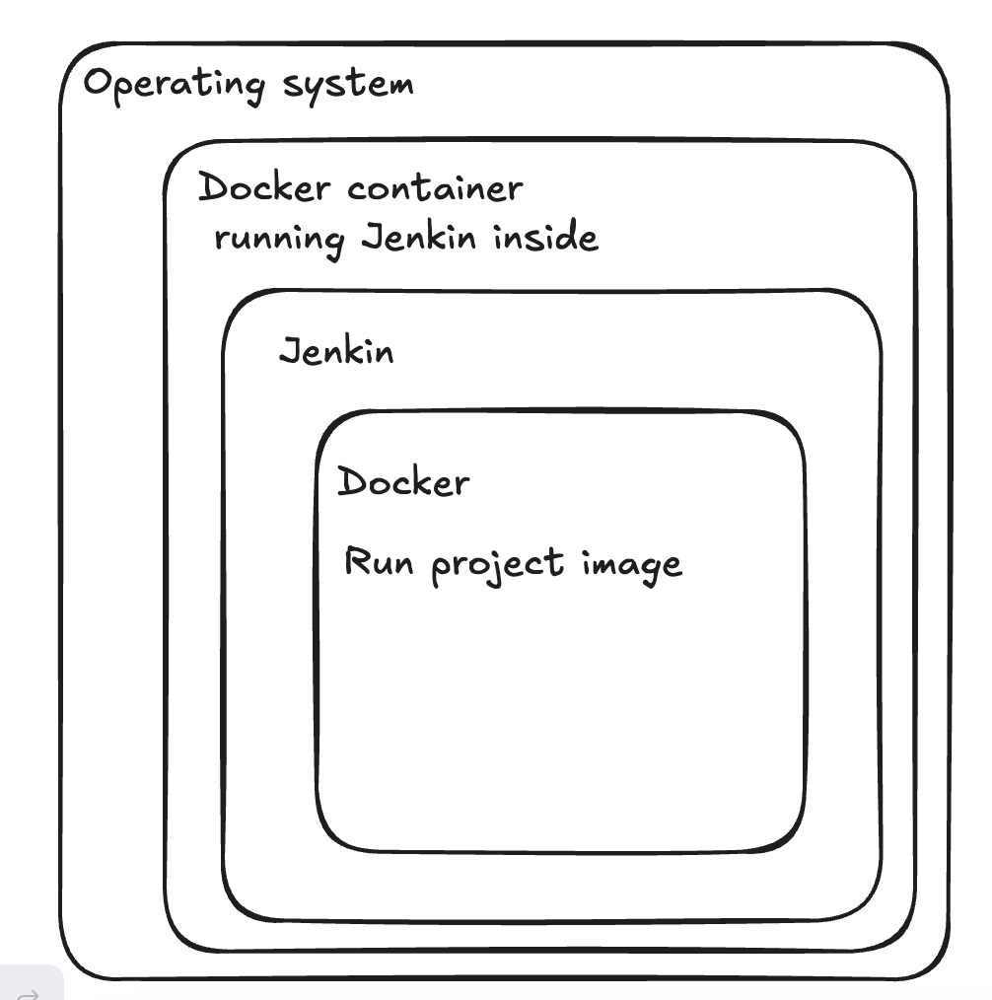

# Cài đặt jenkins
Jenkin thường được chạy nhưng một app độc lập với process riêng.
Jenkin war file chứa:
    - Winstone: command line interface
    - Jetty servlet container wrapper
Có thể chạy Jenkin war file trên bất cứ hệ điều hành nào có phiên bản Java  tương thích vơí Jenkin

Về mặt lý thuyết, Jenkin có thể chạy như một servlet trong một servlet container như Apache Tomcat, nhưng trong thực tế có nhiều vấn đề chưa được kiểm thử => không khuyến khích

## Cài đặt với Docker

### Docker là gì?
Docker cho phép thực hiện chạy chương trình trong một môi trường khép kín gọi là container.
Ứng dụng như Jenkin có thể được tải về như một images *(chỉ đọc)* và chạy trong Docker.
Docker container chứa một instance của Docker image.

Docker cho phép các ứng dụng chạy ở bất kì môi trường hệ điều hành/ cloud service nào hỗ trợ Docker. (MacOS, Linux, Windows, GCP, Azure, AWS)

### Cài đặt Docker
**1. Yêu cầu phần cứng- phần mềm**

- Yêu cầu phần cứng: tra cứu tại https://www.jenkins.io/doc/book/scaling/hardware-recommendations/

- Java: phiên bản JDK 17 hoặc 21 ( recommended) - Các phiên bản khác tra cứu tại: https://www.jenkins.io/doc/book/platform-information/support-policy-java/

> Nếu cài đặt Docker ở một hệ điều hành dạng Linux, phải đảm bảo cấu hình Docker để có thể quản lý như một non-root user - refer: [Post-installati](https://docs.docker.com/engine/installation/linux/linux-postinstall/)

**2. Tải và chạy Jenkin ở Docker**

> Phiên bản image của Jenkin trong Docker hub (https://hub.docker.com/r/jenkins/jenkins/) chứa bản LTS của Jenkin, không chứa Docker CLI, không chứa các plugin và tính năng được dùng nhiều của BlueOcean

Mô tả phương pháp: 


2.1 MacOS and Linux
1. Mở terminal
2. Tạo một cầu nối mạng ( bridge network) trong Docker với câu lệnh `docker network create jenkins`
3. Để chạy được các câu lệnh Docker trong Jenkin node, tải `docker:dind` sử dụng câu lệnh:
```bash
docker run \
--name jenkins-docker \  (1)
--rm \    (2)
--detach \    (3)
--privileged \    (4)
--network jenkins \   (5)
--network-alias docker \  (6)
--env DOCKER_TLS_CERTDIR=/certs \     (7)
--volume jenkins-docker-certs:/certs/client \     (8)
--volume jenkins-data:/var/jenkins_home \     (9)
--publish 2376:2376 \     (10)
docker:dind \     (11)
--storage-driver overlay2     (12)
```

Note: 
- (1) Optional - khai báo tên docker container
- (2) Optional - **Tự động** xoá Docker container khi tắt docker
- (3) Optional - Chạy nền Docker container - tắt bằng câu lệnh `docker stop jenkins-docker`
- (4) Chạy Docker với các đặc quyền truy cập để đảm bảo hoạt động bình thường
- (5) Network bridge được tạo ra ở step 2
- (6) Cho phép Docker khả dụng với hostname `docker` và network `jenkins`
- (7) Mở TLS trong Docker server - recommended - yêu cầu quyền sử dụng shảed volume ( mô tả phía dưới)
- (8) Map đường dẫn  `/certs/client` trong container tới một Docker volumn có tên `jenkins-docker-certs` 
- (9) Map thư mục `/var/jenkins_home` trong container tới một Docker volume tên `jenkins-data` -> cho phép các Docker container khác ( được quản lý bởi Docker container daemon này (This Docker container daemon)) có thể gắn (mount) dữ liệu từ Jenkins
- (10) Optional - Mở port của Docker deamon tới máy host ( máy chạy Docker) - nên dùng, cho phép chạy các câu lệnh của Docker từ máy host nhằm điều khiển Docker daemon 
- (11) Image `docker:dind` -> tải về trước khi chạy câu lệnh trên `docker image pull docker:dind`
- (12) Trình điều khiển lưu trữ của Docker volume - refer: https://docs.docker.com/storage/storagedriver/select-storage-driver


4. Tuỳ chỉnh Docker image chính thức của Jenkin với 2 bước:

    a. Tạo `Dockerfile` với câu lệnh 
    ```bash
    FROM jenkins/jenkins:2.492.3-jdk17
    USER root
    RUN apt-get update && apt-get install -y lsb-release ca-certificates curl && \
        install -m 0755 -d /etc/apt/keyrings && \
        curl -fsSL https://download.docker.com/linux/debian/gpg -o /etc/apt/keyrings/docker.asc && \
        chmod a+r /etc/apt/keyrings/docker.asc && \
        echo "deb [arch=$(dpkg --print-architecture) signed-by=/etc/apt/keyrings/docker.asc] \
        https://download.docker.com/linux/debian $(. /etc/os-release && echo \"$VERSION_CODENAME\") stable" \
        | tee /etc/apt/sources.list.d/docker.list > /dev/null && \
        apt-get update && apt-get install -y docker-ce-cli && \
        apt-get clean && rm -rf /var/lib/apt/lists/*
    USER jenkins
    RUN jenkins-plugin-cli --plugins "blueocean docker-workflow"
    ```
    b. Build Docker image mới với `Dockerfile` trên, và cho nó một cái tên có ý nghĩa. VD: 
    `docker build -t myjenkins-blueocean:2.492.3-1`

5. Chạy image đã tạo ở bước 4 với câu lệnh `docker run`:
    ```bash
    docker run \
    --name jenkins-blueocean \
    --restart=on-failure \
    --detach \
    --network jenkins \
    --env DOCKER_HOST=tcp://docker:2376 \
    --env DOCKER_CERT_PATH=/certs/client \
    --env DOCKER_TLS_VERIFY=1 \
    --publish 8080:8080 \
    --publish 50000:50000 \
    --volume jenkins-data:/var/jenkins_home \
    --volume jenkins-docker-certs:/certs/client:ro \
    myjenkins-blueocean:2.492.3-1
    ```

    - (1): Optional - định danh Docker container
    - (2): Luôn luôn restart container nếu nó dừng lại (bị lỗi). Nếu container được dừng bởi người dùng, thì container chỉ được chạy lại khi daemon khởi động lại hoặc được khởi động lại thủ công
    - (3) Optional - chạy nền (detached mode) 
    - (4) Kết nối Docker container tới mạng jenkin được cài đặt trước đó
    - (5) Chỉ rõ các biến môi trường được dùng bởi docker, docker-compose và các tool khác của Docker để connect tới Docker daemon ở bước trước
    - (6) Map port 8080 của container tới port 8080 của máy host `<host port>:<container port>`
    - (7) (Optional) Map port 50000 của container hiện tại tới port 50000 của máy host. Chỉ cần khi muốn cài đặt thêm các Jenkin agent ( ở máy khác) muốn tương tác với container jenkins-blueocean (Jenkins "controller") 
    > refer tới official doc - cài đặt Jenkin trong Docker không được recommended trong môi trường thực tế

    - (8) Map /var/jenkins_home trong container tới Docker Volume với tên jenkins_data. 
    - (9) Map thư mục (đường dẫn) /certs/client tới jenkins-docker-certs.
    - (10) tên Docker image, built ở step trước


## Cài đặt với Linux

### Debian/Ubuntu

Cài đặt Jenkin với `apt`

```bash
sudo wget -O /usr/share/keyrings/jenkins-keyring.asc \
  https://pkg.jenkins.io/debian-stable/jenkins.io-2023.key
echo "deb [signed-by=/usr/share/keyrings/jenkins-keyring.asc]" \
  https://pkg.jenkins.io/debian-stable binary/ | sudo tee \
  /etc/apt/sources.list.d/jenkins.list > /dev/null
sudo apt-get update
sudo apt-get install jenkins
```

Cài đặt Java

```bash
sudo apt update
sudo apt install fontconfig openjdk-21-jre
java -version
openjdk version "21.0.3" 2024-04-16
OpenJDK Runtime Environment (build 21.0.3+11-Debian-2)
OpenJDK 64-Bit Server VM (build 21.0.3+11-Debian-2, mixed mode, sharing)
```

## Post-installation setup wizard

### Unlocking Jenkins
Sau khi cài đặt, lần đầu tiên truy cập Jenkins sẽ yêu cầu unlock với password được tự gen của Jenkin.

1. Mở `https://localhost:8080` và chờ trang Unlock xuất hiện
Nếu cài đặt Jenkin trên server và không có giao diện, cần thực hiện mở external port để truy cập trang `localhost:8080` 

    VD: tunnel thông qua một SSH connection

        `"<remote host>" -p 22 -oIdentitiesOnly=yes -L "<origin host>:<port>:<remote host>:<port>"`
    
2. Trên trang Unlock, copy đường dẫn hiển thị, vào terminal gõ 
`cat <đường dẫn>` để lấy thông tin password

    > Password này cần được dùng để có thể vào giao diện chính của Jenkin, ngoài ra nó cũng là password mặc định của tài khoản admin (username `admin`) nếu bỏ qua bước tạo user trong quá trình cài đặt

    admin/ 577f0767ad8842298118de410f6a59ff

3. Tuỳ biến Jenkins với plugins

    Có hai option:
    - Install suggested plugins: phù hợp cho đại đa số, cài các plugins được gợi ý bởi Jenkin
    - Select plugin to install: tự chọn cài đặt plugin

4. Tạo tài khoản admin đầu tiên

    Sau khi cài đặt xong Jenkin, tới bước tạo tài khoản Admin
    Điền các field cần thiết, rồi ấn **Save and Finish**